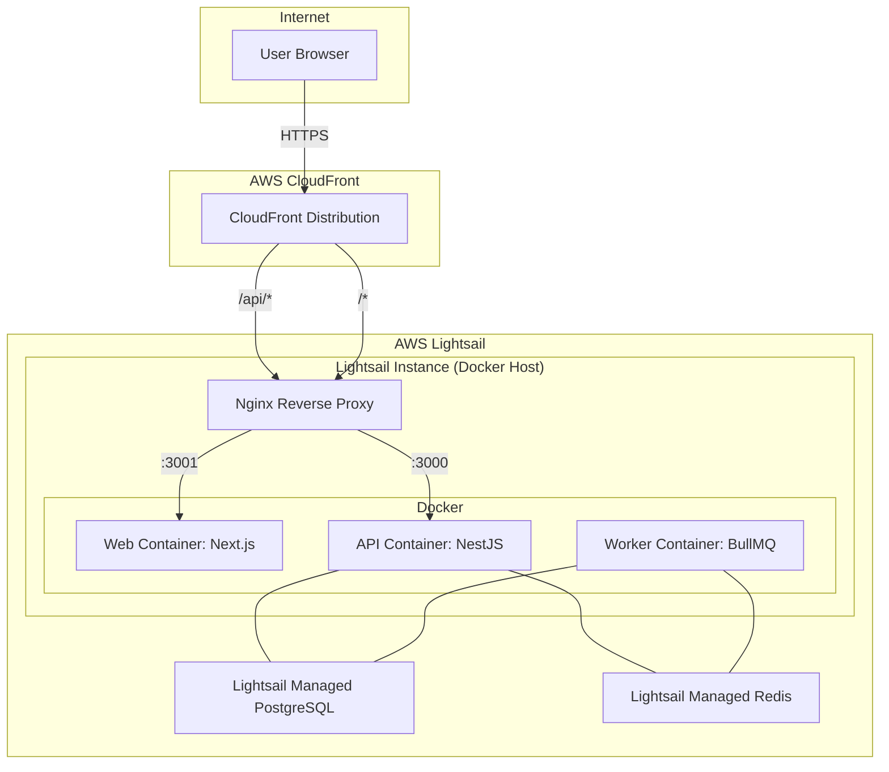

# Deploying Triage-Insight to AWS

This guide provides a complete walkthrough for deploying the Triage-Insight monorepo to a scalable, production-ready AWS environment. The architecture is designed for a balance of cost-effectiveness and performance, leveraging AWS Lightsail for the backend and CloudFront for global content delivery.

## Architecture Overview

The deployment architecture consists of two main parts:

1.  **Web Frontend:** The Next.js web application is served by a Node.js container running on **AWS Lightsail**. This is necessary because the app uses Next.js middleware for authentication, which prevents a pure static export to S3.

2.  **Backend Services:** The backend runs on a single **AWS Lightsail** instance, orchestrated with Docker Compose. This includes:
    *   **NestJS API:** The main REST API.
    *   **BullMQ Worker:** A dedicated container for processing background jobs.
    *   **PostgreSQL:** A **Lightsail Managed Database** with the `pgvector` extension.
    *   **Redis:** A **Lightsail Managed Redis Cache** for the BullMQ queues.

**AWS CloudFront** sits in front of everything, acting as the single entry point. It routes traffic to the web and API containers and provides SSL termination, caching for static assets, and a global content delivery network (CDN).



---

## Prerequisites

Before you begin, ensure you have the following:

*   An **AWS account** with billing enabled.
*   A **GitHub account** with the `triage-insight` repository forked or cloned.
*   A **registered domain name**.
*   **AWS CLI** installed and configured on your local machine.
*   **Docker** and **Docker Compose** installed on your local machine.

---

## Step 1: AWS IAM Setup

First, create an IAM user that GitHub Actions will use to deploy resources to your AWS account.

1.  **Create the IAM Policy:**
    *   Navigate to the IAM console in AWS.
    *   Go to **Policies** and click **Create policy**.
    *   Switch to the **JSON** tab and paste the contents of `infra/lightsail/iam-deploy-policy.json`. Remember to replace `ACCOUNT_ID` and `REGION` with your own.
    *   Name the policy `GitHubActions-TriageInsight-Deploy` and create it.

2.  **Create the IAM User:**
    *   Go to **Users** and click **Create user**.
    *   Name the user `github-actions-deploy`.
    *   Select **Attach policies directly** and choose the policy you just created.
    *   After creating the user, go to the **Security credentials** tab and create an access key. **Save the Access Key ID and Secret Access Key immediately**; you will not be able to see the secret again.

3.  **Add Credentials to GitHub Secrets:**
    *   In your GitHub repository, go to **Settings** > **Secrets and variables** > **Actions**.
    *   Create the following repository secrets:
        *   `AWS_ACCESS_KEY_ID`: The Access Key ID you just saved.
        *   `AWS_SECRET_ACCESS_KEY`: The Secret Access Key you just saved.
        *   `AWS_REGION`: The AWS region you will be deploying to (e.g., `us-east-1`).

---

## Step 2: AWS ECR Setup

Next, create the Amazon ECR (Elastic Container Registry) repositories where your Docker images will be stored.

1.  **Run the Creation Script:**
    *   From your local terminal, run the following script. Make sure your AWS CLI is configured with credentials that have ECR permissions.

    ```bash
    bash infra/lightsail/create-ecr-repos.sh
    ```

2.  **Add ECR Registry URI to GitHub Secrets:**
    *   The script will output your ECR registry URI. It will look like `123456789012.dkr.ecr.us-east-1.amazonaws.com`.
    *   Add this value as a new GitHub secret named `ECR_REGISTRY`.

---

## Step 3: Lightsail Setup

Now, set up the core infrastructure on AWS Lightsail.

1.  **Create Managed PostgreSQL Database:**
    *   Go to the Lightsail console and create a new **Database**.
    *   Choose **PostgreSQL 16** and select a plan (the smallest is fine to start).
    *   Set the username to `triage` and let Lightsail generate a secure password. **Save this password**.
    *   Ensure the database is in the same region as your other resources.

2.  **Create Managed Redis Cache:**
    *   In Lightsail, create a new **Database**.
    *   Choose **Redis** and select a plan.

3.  **Create Lightsail Instance:**
    *   Create a new **Instance**.
    *   Select **Linux/Unix** and **OS Only** > **Ubuntu 22.04 LTS**.
    *   Choose an instance plan (e.g., the $20/month plan with 4 GB RAM is a good starting point).
    *   **Important:** Under **Networking**, enable **IPv6**. CloudFront works best with a dual-stack origin.

4.  **Bootstrap the Instance:**
    *   Once the instance is running, SSH into it.
    *   Run the bootstrap script to install Docker, Nginx, and other dependencies:

    ```bash
    curl -fsSL https://raw.githubusercontent.com/avickmukh/triage-insight/main/infra/lightsail/bootstrap.sh | bash
    ```

5.  **Configure Nginx:**
    *   Copy the provided Nginx config to the instance:

    ```bash
    sudo cp infra/lightsail/nginx.conf /etc/nginx/sites-available/triage-insight
    ```

    *   Edit the file and replace `YOUR_DOMAIN` with your actual domain.
    *   Enable the site and reload Nginx:

    ```bash
    sudo ln -s /etc/nginx/sites-available/triage-insight /etc/nginx/sites-enabled/
    sudo nginx -t && sudo systemctl reload nginx
    ```

6.  **Add Production Environment Variables:**
    *   Create a file at `/home/ubuntu/triage-insight/.env.production` on your Lightsail instance.
    *   Use `infra/lightsail/env.production.template` as a guide. Fill in all the `CHANGE_ME` values, especially the `DATABASE_URL` and `REDIS_HOST` from your Lightsail managed services.

---

## Step 4: CloudFront Setup

1.  **Create ACM Certificate:**
    *   In the AWS console, go to **AWS Certificate Manager (ACM)**.
    *   **Important:** Make sure you are in the **us-east-1 (N. Virginia)** region, as this is required for CloudFront.
    *   Request a public certificate for your domain (e.g., `app.yourdomain.com` and `api.yourdomain.com`).
    *   Complete the DNS validation steps.

2.  **Create CloudFront Distribution:**
    *   Go to the CloudFront console and create a new distribution.
    *   Use the `infra/cloudfront/distribution-config.json` file as a reference for all settings.
    *   **Origin:** Set the origin domain to the public IP address of your Lightsail instance.
    *   **Behaviors:** Create the behaviors for `/api/*`, `/_next/static/*`, and `/static/*`.
    *   **Certificate:** Select the ACM certificate you created.

3.  **Update DNS:**
    *   In your domain registrar's DNS settings, create a CNAME record pointing your subdomain (e.g., `app.yourdomain.com`) to the CloudFront distribution domain name (e.g., `d12345.cloudfront.net`).

---

## Step 5: GitHub Actions Setup

Add the remaining secrets to your GitHub repository:

*   `LIGHTSAIL_HOST`: The public IP of your Lightsail instance.
*   `LIGHTSAIL_SSH_KEY`: The private SSH key for your Lightsail instance, base64-encoded. You can get this from the Lightsail console and encode it with `cat key.pem | base64`.
*   `CLOUDFRONT_DISTRIBUTION_ID`: The ID of your CloudFront distribution.
*   `NEXT_PUBLIC_API_BASE_URL`: The full public URL to your API (e.g., `https://app.yourdomain.com/api/v1`).

---

## Step 6: First Deployment

With all the infrastructure and secrets in place, you are ready to deploy.

1.  **Trigger the Workflow:**
    *   Push a commit to the `main` branch.
    *   Alternatively, go to the **Actions** tab in GitHub, select the **Deploy to AWS** workflow, and run it manually.

2.  **Monitor the Deployment:**
    *   The GitHub Actions workflow will build the Docker images, push them to ECR, SSH into your Lightsail instance, and run the `deploy.sh` script. This script pulls the new images and restarts the services using Docker Compose.

Your Triage-Insight application is now live!
