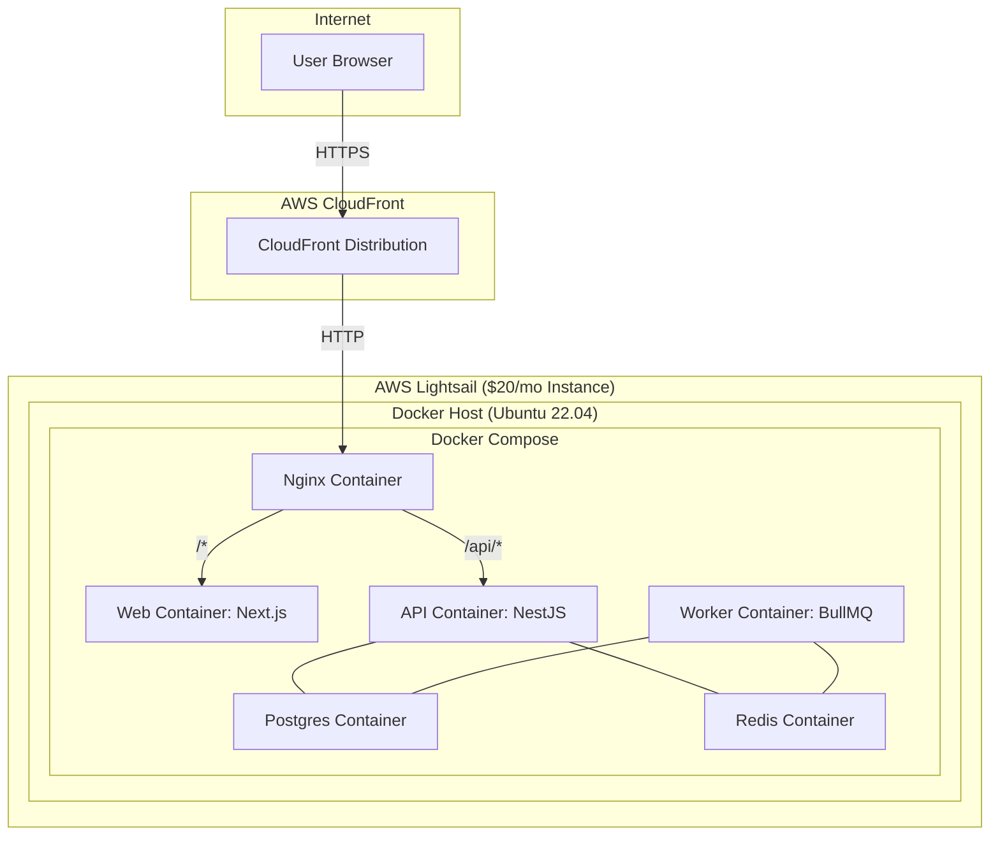

# Deploying Triage-Insight to AWS on a Budget ($25/month)

This guide provides a complete walkthrough for deploying the Triage-Insight monorepo to a cost-effective, single-box AWS environment. The architecture is designed to fit within a strict **$25/month budget**, making it ideal for pilots, demos, or small-scale production use.

## Architecture: The All-in-One Lightsail Box

To meet the budget, all services run on a **single AWS Lightsail instance** orchestrated with Docker Compose. This includes the application services (web, API, worker) and the stateful services (PostgreSQL, Redis), which are self-hosted in containers.

**AWS CloudFront** sits in front, providing a global CDN, SSL termination, and caching for static assets. **AWS ECR** is used for storing the Docker images built by the CI/CD pipeline.



### Cost Breakdown

This architecture is designed to be highly cost-effective.

| Service | Plan | Estimated Monthly Cost |
| :--- | :--- | :--- |
| **AWS Lightsail Instance** | 4 GB RAM, 2 vCPU, 80 GB SSD | **$20.00** |
| **AWS ECR** | 1 GB/month storage | ~$0.10 |
| **AWS CloudFront** | 1 TB/month data transfer | ~$1.00 |
| **Data Transfer** | Outbound to internet | ~$2.00 |
| **Total Estimated Cost** | | **~$23.10 / month** |

> **Note on the 2 GB Plan ($10/mo):** While technically possible, the 2 GB RAM instance is **not recommended**. With all services running, memory pressure will be high, leading to poor performance and potential crashes. Use it only for brief testing or demos.

### Risks of Self-Hosting

Running PostgreSQL and Redis on the same instance as the application carries inherent risks compared to using managed services:

*   **Single Point of Failure:** If the Lightsail instance goes down, your entire application, including the database, is offline.
*   **Data Durability:** Data is persisted to a Docker volume on the instance's local SSD. If the instance is terminated or the volume is corrupted, data loss will occur. **Regular backups are critical.**
*   **Resource Contention:** The database, cache, and application services all share the same CPU and RAM. A spike in API traffic could starve the database of resources, and vice-versa.
*   **Maintenance Overhead:** You are responsible for monitoring, backups, and any necessary updates for PostgreSQL and Redis.

---

## Step 1: IAM & ECR Setup

First, set up the AWS permissions and container registry.

1.  **Create IAM Policy & User:**
    *   In the AWS IAM console, create a new policy using the JSON from `infra/lightsail/iam-deploy-policy.json`. Name it `TriageInsight-Deploy-Policy`.
    *   Create an IAM user named `github-actions-deploy` and attach this policy.
    *   Generate an access key for the user and save the credentials.

2.  **Create ECR Repositories:**
    *   From your local machine (with AWS CLI configured), run the setup script:
        ```bash
        bash infra/lightsail/create-ecr-repos.sh
        ```

3.  **Add GitHub Secrets:**
    *   In your GitHub repo settings, add the following secrets:
        *   `AWS_ACCESS_KEY_ID`: The IAM user's access key.
        *   `AWS_SECRET_ACCESS_KEY`: The IAM user's secret key.
        *   `AWS_REGION`: Your AWS region (e.g., `us-east-1`).
        *   `ECR_REGISTRY`: The registry URI from the script output (e.g., `123456789012.dkr.ecr.us-east-1.amazonaws.com`).

---

## Step 2: Lightsail Instance Setup

Next, provision and configure the single Lightsail server.

1.  **Create Lightsail Instance:**
    *   In the Lightsail console, create a new instance.
    *   Select **Linux/Unix** and **OS Only** > **Ubuntu 22.04 LTS**.
    *   Choose the **$20/month (4 GB RAM)** plan.
    *   Enable **IPv6 networking**.

2.  **Bootstrap the Instance:**
    *   SSH into the new instance as the `ubuntu` user.
    *   Run the bootstrap script to install Docker, AWS CLI, and configure the firewall:
        ```bash
        curl -fsSL https://raw.githubusercontent.com/avickmukh/triage-insight/main/infra/lightsail/bootstrap.sh | bash
        ```
    *   **Log out and log back in** for the Docker group changes to take effect.

3.  **Create Production Environment File:**
    *   On the Lightsail instance, create the environment file:
        ```bash
        nano /home/ubuntu/triage-insight/.env.production
        ```
    *   Copy the contents of `infra/lightsail/env.production.template` into this file.
    *   **Crucially, change all `CHANGE_ME` values**, especially `POSTGRES_PASSWORD` and `JWT_SECRET`.

---

## Step 3: CloudFront & DNS Setup

Set up CloudFront to serve traffic and manage SSL.

1.  **Create ACM Certificate:**
    *   In the AWS Certificate Manager (ACM) console, in region **us-east-1 (N. Virginia)**, request a public certificate for your domain (e.g., `app.yourdomain.com`).

2.  **Create CloudFront Distribution:**
    *   In the CloudFront console, create a new distribution.
    *   Set the **Origin Domain** to the public IP address of your Lightsail instance.
    *   Set **Viewer Protocol Policy** to **Redirect HTTP to HTTPS**.
    *   Under **Cache key and origin requests**, select **Cache policy and origin request policy (recommended)**.
        *   **Cache Policy:** `CachingDisabled`
        *   **Origin Request Policy:** `AllViewer`
    *   Select the ACM certificate you created.

3.  **Configure DNS:**
    *   In your DNS provider, create a `CNAME` record for your app's hostname (e.g., `app.yourdomain.com`) pointing to the CloudFront distribution domain (e.g., `d123abc.cloudfront.net`).

---

## Step 4: Final Secrets & First Deployment

1.  **Add Final GitHub Secrets:**
    *   `LIGHTSAIL_HOST`: The public IP of your Lightsail instance.
    *   `LIGHTSAIL_SSH_KEY`: The private SSH key for your Lightsail instance, **base64-encoded**. (Run `cat key.pem | base64 | tr -d '\n'` to encode it).
    *   `CLOUDFRONT_DISTRIBUTION_ID`: The ID of your CloudFront distribution.
    *   `NEXT_PUBLIC_API_BASE_URL`: The full public URL to your API (e.g., `https://app.yourdomain.com/api/v1`).

2.  **Deploy!**
    *   Push a commit to the `main` branch.
    *   The GitHub Actions workflow will build and push the images, then SSH into your Lightsail instance to run the `deploy.sh` script, which starts all services via Docker Compose.

---

## Backups & Maintenance

With a self-hosted database, backups are your responsibility.

*   **Automated Backups:** A backup script is provided at `infra/lightsail/backup-postgres.sh`. It creates a compressed `pg_dump` of the database and can upload it to S3.
*   **Scheduling:** Set up a cron job on the Lightsail instance to run this script daily:
    ```bash
    # Run: crontab -e
    # Add this line to run the backup at 2 AM every day:
    0 2 * * * /home/ubuntu/triage-insight/infra/lightsail/backup-postgres.sh >> /var/log/triage-backup.log 2>&1
    ```
*   **Restoring:** To restore from a backup, you would copy the backup file to the instance, `gunzip` it, and pipe the `.sql` file into the `postgres` container using `docker exec -i triage-postgres psql -U triage -d triageinsight < backup.sql`.
